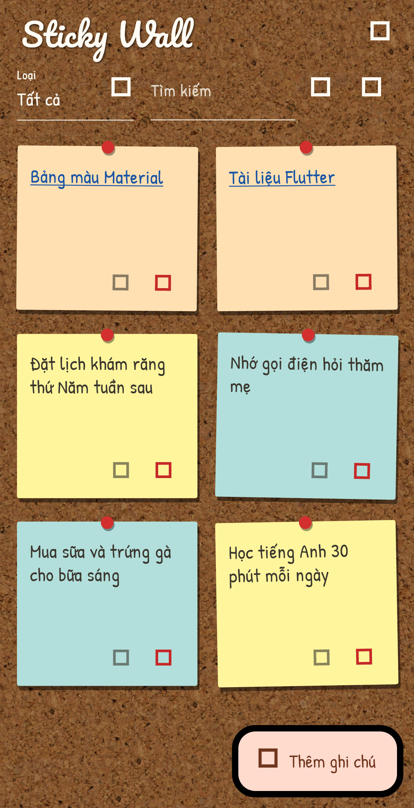

# Sticky Wall

A Flutter sticky-notes / bookmarks app — pastel paper notes pinned to a real
wall texture, written in a handwriting font. Bilingual (English / Tiếng Việt).
Modeled after the original "Mia Note" Angular + Electron desktop app.

| Cork board | Green chalkboard | Black chalkboard |
|---|---|---|
|  |  |  |

| Painted wall | Brick wall | Wood planks |
|---|---|---|
|  |  |  |

## Features

- Two note types: **Normal** (free multi-line text) and **Link** (a label + URL)
- Add / edit / delete notes, with duplicate prevention and delete confirmation
- Live search across note content and URLs
- Filter by type (All / Normal / Link), asc/desc sort, list or grid view
- **Six switchable walls**: cork board, green/black chalkboard, painted
  plaster, brick, wood planks
- **Four selectable fonts** — Patrick Hand, Itim, Dancing Script,
  Be Vietnam Pro — all with full Vietnamese diacritics support
- **Bilingual UI**: English and Tiếng Việt, following the system locale or
  set manually in the Customize sheet
- Notes are pastel paper cards with a push-pin, a deterministic color and a
  slight hand-stuck tilt (both derived from the note's guid, so they're stable)
- Link notes open in the system browser
- All data and preferences persist locally on the device (no backend)

## Getting started

```sh
flutter pub get
flutter run
```

Localizations are generated from `lib/l10n/*.arb` on `flutter pub get`
(see `l10n.yaml`). To add a language, add `app_<code>.arb` and rerun.

## Design: keeping writing and wall in harmony

- Every wall texture sits under a tuned scrim overlay (`WallStyle.overlay`)
  that quiets the texture so text keeps ~4.5:1 contrast. The two chalkboards
  are the same concrete texture under different scrims.
- Text written directly on the wall (title, empty state, toolbar) uses
  chalk-white with a soft shadow on dark walls, dark ink on light walls —
  chosen per wall via `WallStyle.dark`.
- Note text never sits on the busy texture: it's always dark ink on a pastel
  paper card with its own drop shadow.
- The selected handwriting family styles notes and UI alike; each font
  carries an optical `scale` so scripts with a small x-height (Dancing
  Script) read at the same size as the others. Pacifico is reserved for the
  app title.

## Assets & credits

- Wall textures: [ambientCG](https://ambientcg.com) — Cork004,
  PaintedPlaster017, Concrete046, Bricks104, Planks021. License: CC0
  (public domain).
- Fonts from Google Fonts, SIL Open Font License (copies in `assets/fonts/`):
  [Patrick Hand](https://fonts.google.com/specimen/Patrick+Hand),
  [Itim](https://fonts.google.com/specimen/Itim),
  [Dancing Script](https://fonts.google.com/specimen/Dancing+Script),
  [Be Vietnam Pro](https://fonts.google.com/specimen/Be+Vietnam+Pro),
  [Pacifico](https://fonts.google.com/specimen/Pacifico) (title only).
  All include the Vietnamese subset.

## Structure

| Path | Purpose |
|---|---|
| `lib/models/note.dart` | Note model (guid, content, url) |
| `lib/services/note_storage.dart` | Local persistence via `shared_preferences` |
| `lib/services/settings_controller.dart` | Wall / font / language state |
| `lib/screens/home_screen.dart` | Main screen: header, toolbar, wall, list/grid |
| `lib/widgets/note_dialog.dart` | Create/Edit note dialog with validation |
| `lib/widgets/note_views.dart` | Sticky-note card and paper-strip renderings |
| `lib/widgets/settings_sheet.dart` | Customize sheet (wall, font, language) |
| `lib/theme.dart` | Walls, fonts, palette, theme |
| `lib/l10n/` | ARB sources + generated localizations |
| `test/preview_test.dart` | Screenshot generator (skipped by default) |
