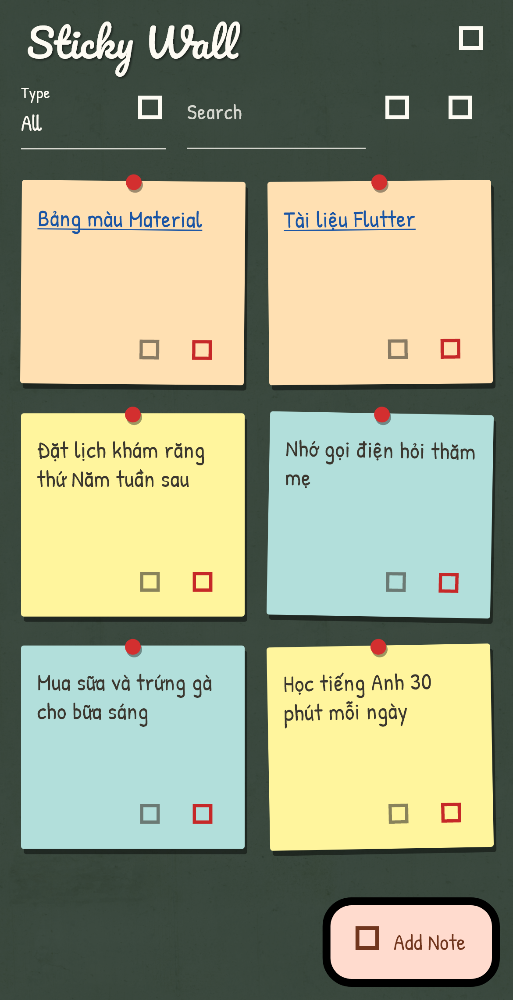

# Sticky Wall

A Flutter sticky-notes / bookmarks app — pastel paper notes pinned to a real
wall texture, written in a handwriting font. Modeled after the original
"Mia Note" Angular + Electron desktop app.

| Cork board | Chalkboard | Painted wall |
|---|---|---|
|  |  |  |

## Features

- Two note types: **Normal** (free multi-line text) and **Link** (a label + URL)
- Add / edit / delete notes, with duplicate prevention and delete confirmation
- Live search across note content and URLs
- Filter by type (All / Normal / Link), asc/desc sort, list or grid view
- **Three switchable walls**: cork board, chalkboard, painted plaster
- Notes are pastel paper cards with a push-pin, a deterministic color and a
  slight hand-stuck tilt (both derived from the note's guid, so they're stable)
- Link notes open in the system browser
- All data and view settings persist locally on the device (no backend)

## Getting started

```sh
flutter pub get
flutter run
```

## Design: keeping writing and wall in harmony

- Every wall texture sits under a tuned scrim overlay (`WallStyle.overlay`)
  that quiets the texture so text keeps ~4.5:1 contrast.
- Text written directly on the wall (title, empty state, toolbar) uses
  chalk-white with a soft shadow on dark walls, dark ink on light walls —
  chosen per wall via `WallStyle.dark`.
- Note text never sits on the busy texture: it's always dark ink on a pastel
  paper card with its own drop shadow.
- One handwriting family (Patrick Hand) unifies the "written by hand" feel;
  the Pacifico script is reserved for the app title.

## Assets & credits

- Wall textures: [ambientCG](https://ambientcg.com) — Cork004,
  PaintedPlaster017, Concrete046 (the chalkboard is Concrete046 under a dark
  green scrim). License: CC0 (public domain).
- Fonts: [Patrick Hand](https://fonts.google.com/specimen/Patrick+Hand) and
  [Pacifico](https://fonts.google.com/specimen/Pacifico) from Google Fonts,
  SIL Open Font License (copies in `assets/fonts/`). Both include the
  Vietnamese subset, so diacritics render correctly.

## Structure

| Path | Purpose |
|---|---|
| `lib/models/note.dart` | Note model (guid, content, url) |
| `lib/services/note_storage.dart` | Local persistence via `shared_preferences` |
| `lib/screens/home_screen.dart` | Main screen: header, toolbar, wall, list/grid |
| `lib/widgets/note_dialog.dart` | Create/Edit note dialog with validation |
| `lib/widgets/note_views.dart` | Sticky-note card and paper-strip renderings |
| `lib/theme.dart` | Walls, palette, theme |
| `test/preview_test.dart` | Screenshot generator (skipped by default) |
